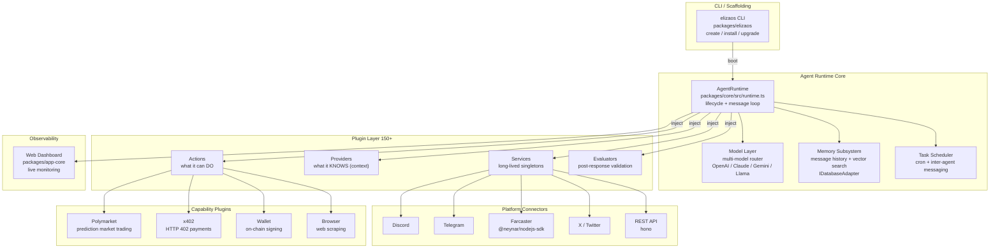

<a name="readme-top"></a>

<div align="center">

# elizaOS

### The production-ready autonomous AI agent framework — plugin-first, model-agnostic, Web3-native

[](LICENSE)
[](https://github.com/elizaos/eliza/stargazers)
[](https://github.com/elizaos/eliza/commits)
[](https://www.typescriptlang.org)

</div>

> **Project at a Glance**
> elizaOS is an open-source framework that turns any LLM into a production-grade autonomous agent in under 30 seconds.
> 150+ plugins. 15+ platforms. One runtime.

---

<details>
  <summary>Table of Contents</summary>
  <ol>
    <li><a href="#problem--solution">Problem & Solution</a></li>
    <li><a href="#demo">Demo</a></li>
    <li><a href="#how-it-works">How it Works</a></li>
    <li><a href="#tech-stack">Tech Stack</a></li>
    <li><a href="#why-now--why-us">Why Now & Why Us</a></li>
    <li><a href="#roadmap">Roadmap</a></li>
    <li><a href="#getting-started">Getting Started</a></li>
    <li><a href="#license">License</a></li>
    <li><a href="#contact">Contact</a></li>
    <li><a href="#links">Links</a></li>
  </ol>
</details>

---

## Problem & Solution

80% of hackathon time disappears into scaffolding — LLM wiring, memory management, multi-platform routing, plugin lifecycles, cron jobs. Every team rebuilds the same infrastructure from scratch. The actual agent logic never gets done.

elizaOS packages all that infrastructure into plugins. Teams ship the business logic on day one.

3 design decisions that make this work:

1. **Plugins own everything** — 4 extension points (Action / Provider / Service / Evaluator), 150+ official plugins covering Discord, Telegram, Farcaster, X, Polymarket, x402, and on-chain wallets. Add capabilities with `elizaos install`, zero restarts required.
2. **Model-agnostic by design** — swap OpenAI, Claude, Gemini, or Llama with one config line. Multi-model routing is built in; no adapter rewrites when the model changes.
3. **Multi-agent native** — run N agents in a single process. Shared LLM batch pool, built-in inter-agent task scheduling, per-agent permission gates.

Result: a full Web3 agent (Farcaster broadcast + Polymarket trading + x402 payments) runs end-to-end in 2 days, not 7.

<p align="right">(<a href="#readme-top">back to top</a>)</p>

---

## Demo

> 🌐 Website: https://elizaos.ai
>
> 🎬 Demo video: [TBD]

| Scenario | What it shows |
|----------|--------------|
| CLI scaffolding | `elizaos create my-agent` → full agent project in 30 seconds |
| Multi-platform | 1 Character config connects Discord + Telegram + Farcaster simultaneously |
| Hot plugin install | `elizaos install plugin-polymarket-app` at runtime, no restart |
| Web Dashboard | Live agent status, conversation history, memory, and plugin list |

<p align="right">(<a href="#readme-top">back to top</a>)</p>

---

## How it Works

### Architecture



### Message → Action: the 5-step loop

```
1. Platform connector (Discord / Farcaster / REST) receives a message
   → Service normalizes it into a Memory object and persists it

2. AgentRuntime.handleMessage()
   → Providers inject dynamic context: character config + history + vector search results
   → Final prompt assembled

3. Model Layer calls the LLM
   → Returns text response + tool_use call list

4. Action routing
   → Matches Actions whose validate() passes
   → Executes handler() — may trigger on-chain ops, API calls, cross-agent tasks

5. Evaluator pipeline
   → Post-processes the response (safety, format, business rules)
   → Writes result back to Memory, broadcasts to platform
```

<p align="right">(<a href="#readme-top">back to top</a>)</p>

---

## Tech Stack

### Built With

[![Bun][Bun-badge]][Bun-url] [![TypeScript][TS-badge]][TS-url] [![React][React-badge]][React-url] [![Hono][Hono-badge]][Hono-url] [![Vite][Vite-badge]][Vite-url] [![Zod][Zod-badge]][Zod-url] [![Drizzle][Drizzle-badge]][Drizzle-url] [![Vitest][Vitest-badge]][Vitest-url] [![Cloudflare][CF-badge]][CF-url]

### Details

| Layer | Tech | Version | Why |
|-------|------|---------|-----|
| **Runtime** | Bun | latest | 3× faster startup than Node; native TypeScript, zero compile config |
| **Language** | TypeScript | 6.0 | Strict mode; full inference; monorepo-wide type sharing |
| **Monorepo** | Turbo | latest | Incremental build cache; 50+ packages build in seconds in parallel |
| **Lint / Format** | Biome | 2.x | Replaces ESLint + Prettier as one tool, zero config conflicts |
| **ORM** | drizzle-orm + PGlite | 0.45 / 0.4 | Type-safe SQL; PGlite delivers embedded Postgres with no server |
| **HTTP** | hono | 4.x | Edge-compatible; x402 payment middleware works natively |
| **Validation** | zod | 4.x | Every LLM output and API boundary validated; safeParse never crashes the loop |
| **LLM abstraction** | Vercel AI SDK (`ai`) | 6.x | Unified multi-model interface; streaming + tool_use out of the box |
| **Dashboard** | React + Vite | latest | Lightweight SPA; Cloud build targets Cloudflare Workers |
| **Testing** | Vitest | 4.x | Bun-native; 30+ benchmark suites included |

<p align="right">(<a href="#readme-top">back to top</a>)</p>

---

## Why Now & Why Us

2025 is the year AI agents cross from toy to tool. x402 landed on Base. Farcaster hit 20k daily active users. Polymarket crossed $50M in daily volume. The infrastructure finally exists — but existing frameworks still aren't production-ready for Web3.

LangChain is too academic. AutoGen ignores the plugin ecosystem. CrewAI skips Web3 entirely. elizaOS fills that gap.

| Framework | Plugin ecosystem | Web3-native | Multi-agent | Production-ready |
|-----------|:---:|:---:|:---:|:---:|
| LangChain | ✅ | ❌ | Partial | ❌ |
| AutoGen | ❌ | ❌ | ✅ | ❌ |
| CrewAI | Partial | ❌ | ✅ | ❌ |
| **elizaOS** | ✅ 150+ | ✅ | ✅ | ✅ |

150+ plugins for platform breadth. Built-in x402, Polymarket, and wallet plugins for Web3 depth. No other framework ships both.

<p align="right">(<a href="#readme-top">back to top</a>)</p>

---

## Roadmap

- [x] `@elizaos/core` AgentRuntime + plugin system
- [x] 150+ official plugins (Discord / Telegram / Farcaster / X / Polymarket / x402)
- [x] CLI scaffolding (`elizaos create` / `install`)
- [x] Web Dashboard (live monitoring)
- [x] Multi-agent orchestration + task scheduling
- [x] 30+ benchmark evaluation suites
- [x] Cloud-hosted version (Cloudflare Workers)
- [ ] Full mobile native bridges (Android / iOS)
- [ ] Agent marketplace (publish / subscribe agents)
- [ ] Visual agent flow editor

<p align="right">(<a href="#readme-top">back to top</a>)</p>

---

## License

Distributed under the MIT License. See [`LICENSE`](LICENSE) for more information.

<p align="right">(<a href="#readme-top">back to top</a>)</p>

---

## Contact

elizaOS Team — [@elizaos](https://twitter.com/elizaos) — hello@elizaos.ai

Project Link: [https://github.com/elizaos/eliza](https://github.com/elizaos/eliza)

<p align="right">(<a href="#readme-top">back to top</a>)</p>

---

## Getting Started

### Prerequisites

- Bun >= 1.2 (recommended) or Node.js 20 LTS

### Quickstart

```sh
# Install the CLI
npm install -g @elizaos/elizaos

# Create a new agent project
elizaos create my-agent
cd my-agent

# Add plugins
elizaos install plugin-farcaster
elizaos install plugin-polymarket-app

# Configure environment
cp .env.example .env

# Start
bun start
```

### Run from source

```sh
git clone https://github.com/elizaos/eliza.git
cd eliza
bun install
bun run build
bun run start
```

> Dashboard runs at http://localhost:3000 by default.

<p align="right">(<a href="#readme-top">back to top</a>)</p>

---

## Links

- 🌐 Website: https://elizaos.ai
- 📦 GitHub: https://github.com/elizaos/eliza
- 📚 Docs: https://elizaos.ai/docs
- 💬 Discord: https://discord.gg/elizaos

<p align="right">(<a href="#readme-top">back to top</a>)</p>

<!-- MARKDOWN LINKS & BADGES -->
[Bun-badge]: https://img.shields.io/badge/Bun-000000?style=for-the-badge&logo=bun&logoColor=white
[Bun-url]: https://bun.sh
[TS-badge]: https://img.shields.io/badge/TypeScript-3178C6?style=for-the-badge&logo=typescript&logoColor=white
[TS-url]: https://www.typescriptlang.org
[React-badge]: https://img.shields.io/badge/React-20232A?style=for-the-badge&logo=react&logoColor=61DAFB
[React-url]: https://react.dev
[Hono-badge]: https://img.shields.io/badge/Hono-E36002?style=for-the-badge&logo=hono&logoColor=white
[Hono-url]: https://hono.dev
[Vite-badge]: https://img.shields.io/badge/Vite-646CFF?style=for-the-badge&logo=vite&logoColor=white
[Vite-url]: https://vitejs.dev
[Zod-badge]: https://img.shields.io/badge/Zod-3E67B1?style=for-the-badge&logo=zod&logoColor=white
[Zod-url]: https://zod.dev
[Drizzle-badge]: https://img.shields.io/badge/Drizzle-C5F74F?style=for-the-badge&logo=drizzle&logoColor=black
[Drizzle-url]: https://orm.drizzle.team
[Vitest-badge]: https://img.shields.io/badge/Vitest-6E9F18?style=for-the-badge&logo=vitest&logoColor=white
[Vitest-url]: https://vitest.dev
[CF-badge]: https://img.shields.io/badge/Cloudflare_Workers-F38020?style=for-the-badge&logo=cloudflare&logoColor=white
[CF-url]: https://workers.cloudflare.com
