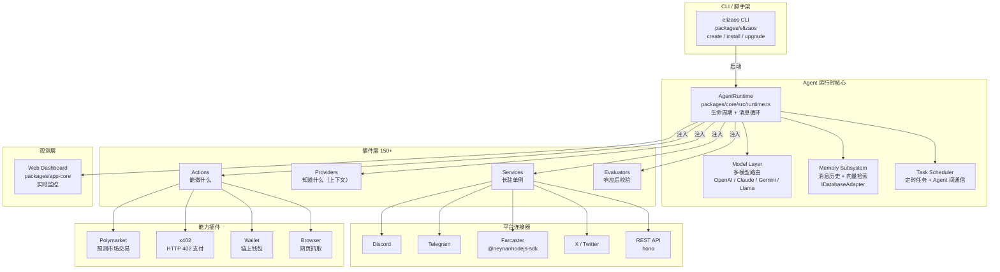

<a name="readme-top"></a>

<div align="center">

# elizaOS

### 生产级自主 AI Agent 框架——插件化、多平台、多模型，开箱即用

[](LICENSE)
[](https://github.com/elizaos/eliza/stargazers)
[](https://github.com/elizaos/eliza/commits)
[](https://www.typescriptlang.org)

</div>

---

<details>
  <summary>目录</summary>
  <ol>
    <li><a href="#problem--solution">Problem & Solution</a></li>
    <li><a href="#demo">Demo</a></li>
    <li><a href="#how-it-works">How it Works</a></li>
    <li><a href="#tech-stack">Tech Stack</a></li>
    <li><a href="#why-now--why-us">Why Now & Why Us</a></li>
    <li><a href="#roadmap">Roadmap</a></li>
    <li><a href="#getting-started">Getting Started</a></li>
    <li><a href="#license">License</a></li>
    <li><a href="#contact">Contact</a></li>
    <li><a href="#links">Links</a></li>
  </ol>
</details>

---

## Problem & Solution

**痛点**：每个团队造 AI Agent 都在从零搭一遍相同的脚手架——LLM 接入、记忆管理、多平台消息路由、插件生命周期、定时任务……光基础设施就要花掉黑客松 80% 的时间，真正的业务逻辑反而没机会做。

**解法**：ElizaOS 是一个可直接投生产的自主 Agent 框架，把所有"基础设施苦活"封装成插件，让开发者聚焦在 Agent 的核心行为上。三个关键设计决策：

1. **插件即一切** — Action / Provider / Service / Evaluator 四种扩展点，150+ 官方插件覆盖 Discord、Telegram、Farcaster、X、Polymarket、x402、钱包等，新能力 `elizaos install` 即得
2. **模型无关** — 同一套 `AgentRuntime`，换一行配置即可切换 OpenAI、Claude、Gemini、Llama；多模型路由内置
3. **多 Agent 原生** — 单进程跑 N 个 Agent，共享 LLM 批处理池，内置 Agent 间任务调度与权限门控

结果：一个完整 Web3 Agent（Farcaster 广播 + Polymarket 交易 + x402 支付）可以在 2 天内跑通，而不是 7 天。

<p align="right">(<a href="#readme-top">back to top</a>)</p>

---

## Demo

> 🌐 官网：https://elizaos.ai
>
> 🎬 Demo 视频：[待补充]

**核心能力展示**：

| 场景 | 说明 |
|------|------|
| CLI 脚手架 | `elizaos create my-agent` → 30 秒生成完整 Agent 项目 |
| 多平台接入 | 同一 Character 同时接 Discord + Telegram + Farcaster |
| 插件热加载 | 运行时 `elizaos install plugin-polymarket-app` 无需重启 |
| Web Dashboard | 实时查看 Agent 状态、对话历史、内存、插件列表 |

<p align="right">(<a href="#readme-top">back to top</a>)</p>

---

## How it Works

### 顶层架构图



### 关键路径：一条消息如何触发 Agent 行动

```
1. 平台连接器（Discord / Farcaster / REST）接收消息
   → Service 标准化为 Memory 对象入库

2. AgentRuntime.handleMessage()
   → Provider 注入动态上下文（角色设定 + 历史记忆 + 向量检索结果）
   → 组装最终 Prompt

3. Model Layer 调用 LLM
   → 返回文本响应 + tool_use 调用列表

4. Action 路由
   → 匹配 validate() 通过的 Action
   → 执行 handler()（可触发链上操作、API 调用、跨 Agent 任务）

5. Evaluator 流水线
   → 对响应做后处理校验（内容安全、格式检查、业务规则）

6. 结果写回 Memory，广播到平台
```

<p align="right">(<a href="#readme-top">back to top</a>)</p>

---

## Tech Stack

### 核心技术栈

[![Bun][Bun-badge]][Bun-url] [![TypeScript][TS-badge]][TS-url] [![React][React-badge]][React-url] [![Hono][Hono-badge]][Hono-url] [![Vite][Vite-badge]][Vite-url] [![Zod][Zod-badge]][Zod-url] [![Drizzle][Drizzle-badge]][Drizzle-url] [![Vitest][Vitest-badge]][Vitest-url] [![Cloudflare][CF-badge]][CF-url]

### 详细说明

| 层 | 技术 | 版本 | 为什么选它 |
|----|------|------|----------|
| **运行时** | Bun | latest | 比 Node 快 3x 启动；原生 TypeScript，零编译配置 |
| **语言** | TypeScript | 6.0 | strict mode，完整类型推断，monorepo 类型共享 |
| **Monorepo** | Turbo | latest | 增量构建缓存，50+ 包并行构建秒级完成 |
| **格式化** | Biome | 2.x | 替代 ESLint + Prettier，单工具零冲突 |
| **ORM** | drizzle-orm + PGlite | 0.45 / 0.4 | 轻量类型安全 SQL；PGlite 实现嵌入式 Postgres |
| **HTTP** | hono | 4.x | 边缘兼容，x402 中间件原生支持 |
| **校验** | zod | 4.x | LLM 输出 + API 边界全量校验，safeParse 不崩循环 |
| **LLM 抽象** | Vercel AI SDK (`ai`) | 6.x | 统一多模型接口，streaming + tool_use 开箱即用 |
| **Dashboard** | React + Vite | latest | 轻量 SPA，Cloud 版走 Cloudflare Workers |
| **测试** | Vitest | 4.x | Bun 原生兼容，30+ benchmark 套件覆盖 |

<p align="right">(<a href="#readme-top">back to top</a>)</p>

---

## Why Now & Why Us

**时机**：2025 年是 AI Agent 从"玩具"变"工具"的分水岭——x402 落地 Base、Farcaster 日活破 2 万、Polymarket 日交易额超 $50M。但现有 Agent 框架要么过于学术（LangChain）、要么锁定单一平台。ElizaOS 正好填补这个空白：生产级、跨平台、Web3 原生。

**差异化**：

| 框架 | 插件生态 | Web3 原生 | 多 Agent | 生产就绪 |
|------|:---:|:---:|:---:|:---:|
| LangChain | ✅ | ❌ | 部分 | ❌ |
| AutoGen | ❌ | ❌ | ✅ | ❌ |
| CrewAI | 部分 | ❌ | ✅ | ❌ |
| **ElizaOS** | ✅ 150+ | ✅ | ✅ | ✅ |

150+ 插件覆盖的平台广度 + 内置 x402 / Polymarket / 钱包的 Web3 深度，是竞品没有的组合。

<p align="right">(<a href="#readme-top">back to top</a>)</p>

---

## Roadmap

- [x] `@elizaos/core` AgentRuntime + 插件系统
- [x] 150+ 官方插件（Discord / Telegram / Farcaster / X / Polymarket / x402）
- [x] CLI 脚手架 (`elizaos create` / `install`)
- [x] Web Dashboard（实时监控）
- [x] 多 Agent 编排 + 任务调度
- [x] 30+ Benchmark 评测套件
- [x] Cloud 托管版（Cloudflare Workers）
- [ ] 移动端原生桥接（Android / iOS）完整覆盖
- [ ] Agent 市场（一键发布 / 订阅 Agent）
- [ ] 可视化 Agent 流程编辑器

<p align="right">(<a href="#readme-top">back to top</a>)</p>

---

## License

MIT License。详见 [`LICENSE`](LICENSE)。

<p align="right">(<a href="#readme-top">back to top</a>)</p>

---

## Contact

elizaOS 团队 — [@elizaos](https://twitter.com/elizaos) — hello@elizaos.ai

项目主页：[https://github.com/elizaos/eliza](https://github.com/elizaos/eliza)

<p align="right">(<a href="#readme-top">back to top</a>)</p>

---

## Getting Started

### 环境要求

- Bun >= 1.2（推荐）或 Node.js 20 LTS

### 快速创建 Agent

```sh
# 安装 CLI
npm install -g @elizaos/elizaos

# 新建项目
elizaos create my-agent
cd my-agent

# 安装插件（按需）
elizaos install plugin-farcaster
elizaos install plugin-polymarket-app

# 配置 .env
cp .env.example .env

# 启动
bun start
```

### 从源码运行

```sh
git clone https://github.com/elizaos/eliza.git
cd eliza
bun install
bun run build
bun run start
```

> Dashboard 默认 http://localhost:3000

<p align="right">(<a href="#readme-top">back to top</a>)</p>

---

## Links

- 🌐 官网：https://elizaos.ai
- 📦 GitHub：https://github.com/elizaos/eliza
- 📚 文档：https://elizaos.ai/docs
- 💬 Discord：https://discord.gg/elizaos

<p align="right">(<a href="#readme-top">back to top</a>)</p>

<!-- MARKDOWN LINKS & BADGES -->
[Bun-badge]: https://img.shields.io/badge/Bun-000000?style=for-the-badge&logo=bun&logoColor=white
[Bun-url]: https://bun.sh
[TS-badge]: https://img.shields.io/badge/TypeScript-3178C6?style=for-the-badge&logo=typescript&logoColor=white
[TS-url]: https://www.typescriptlang.org
[React-badge]: https://img.shields.io/badge/React-20232A?style=for-the-badge&logo=react&logoColor=61DAFB
[React-url]: https://react.dev
[Hono-badge]: https://img.shields.io/badge/Hono-E36002?style=for-the-badge&logo=hono&logoColor=white
[Hono-url]: https://hono.dev
[Vite-badge]: https://img.shields.io/badge/Vite-646CFF?style=for-the-badge&logo=vite&logoColor=white
[Vite-url]: https://vitejs.dev
[Zod-badge]: https://img.shields.io/badge/Zod-3E67B1?style=for-the-badge&logo=zod&logoColor=white
[Zod-url]: https://zod.dev
[Drizzle-badge]: https://img.shields.io/badge/Drizzle-C5F74F?style=for-the-badge&logo=drizzle&logoColor=black
[Drizzle-url]: https://orm.drizzle.team
[Vitest-badge]: https://img.shields.io/badge/Vitest-6E9F18?style=for-the-badge&logo=vitest&logoColor=white
[Vitest-url]: https://vitest.dev
[CF-badge]: https://img.shields.io/badge/Cloudflare_Workers-F38020?style=for-the-badge&logo=cloudflare&logoColor=white
[CF-url]: https://workers.cloudflare.com
