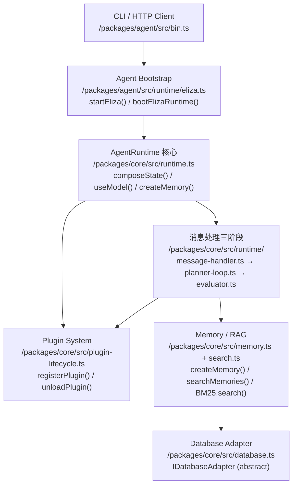
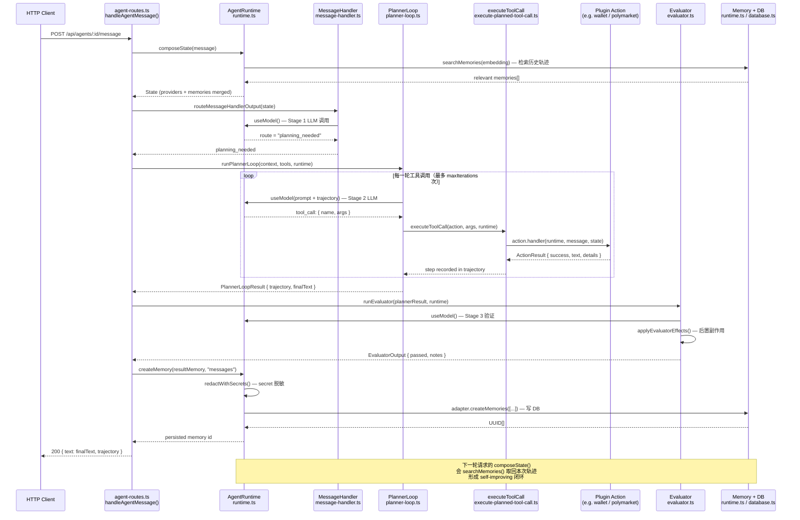

# Project Notes · ElizaOS

> Source: https://github.com/elizaOS/eliza
> Read on: 2026-06-11

## 1. 项目在做什么（一句话）

可插拔的多模态 AI Agent 运行时框架，通过插件化 Action / Provider 体系支持任意 LLM 和链上操作。

## 2. 顶层架构图

## 3. 核心模块表

| 模块 | 路径 | 职责 | 关键文件 |
|---|---|---|---|
| Agent Bootstrap | `/packages/agent/src/runtime/` | 加载 character、启动 HTTP server、注册插件 | `eliza.ts` |
| AgentRuntime | `/packages/core/src/runtime.ts` | 核心上帝对象，持有 actions/providers/memory/services | `runtime.ts` |
| Message Pipeline | `/packages/core/src/runtime/` | 三阶段消息处理（路由→规划→验证） | `message-handler.ts`, `planner-loop.ts`, `evaluator.ts` |
| Plugin System | `/packages/core/src/plugin-lifecycle.ts` | 插件注册/热重载，将 actions/providers 挂载到 runtime | `plugin-lifecycle.ts` |
| Memory / RAG | `/packages/core/src/memory.ts` + `search.ts` | 记忆创建、向量检索、BM25 重排序 | `memory.ts`, `search.ts` |
| Database Adapter | `/packages/core/src/database.ts` | 抽象存储层，支持 SQLite / PostgreSQL / InMemory | `database.ts` |
| Provider System | `/packages/core/src/providers/` | 每轮 composeState 时注入上下文（历史、支付状态等） | `providers/` 目录 |

## 4. 关键路径示例

用户动作：外部 HTTP 请求触发 Agent 完成一次自主决策并执行链上操作

| 步骤 | 描述 | 文件 / 函数 |
|---|---|---|
| 1 | HTTP 请求进入，构造 Memory 对象 | `/packages/agent/src/api/agent-routes.ts: handleAgentMessage()` |
| 2 | 并行调用所有 Providers，合并成 State | `/packages/core/src/runtime.ts: composeState()` |
| 3 | Stage 1：LLM 判断消息路由（忽略 / 简单回复 / 需规划） | `/packages/core/src/runtime/message-handler.ts: routeMessageHandlerOutput()` |
| 4 | Stage 2：多轮工具调用循环，LLM 自主选择并执行 actions | `/packages/core/src/runtime/planner-loop.ts: runPlannerLoop()` ⚠️ 关键跳 |
| 5 | 执行具体 action（链上交易 / DB 写入 / 文件操作） | `/packages/core/src/runtime/execute-planned-tool-call.ts: executeToolCall()` |
| 6 | Stage 3：验证输出，执行后置副作用 | `/packages/core/src/runtime/evaluator.ts: runEvaluator()` |
| 7 | 结果持久化（含 secret 脱敏），写入 DB | `/packages/core/src/runtime.ts: createMemory()` |
| 8 | 下一轮 composeState 时向量检索历史轨迹，形成 self-improving 闭环 | `/packages/core/src/runtime.ts: searchMemories()` + `search.ts: BM25.search()` |

## 5. 3 个可借鉴的设计点

1. **三阶段管道 + 职责隔离**：把 Agent 决策拆成"路由判断 → 多轮工具执行 → 输出验证"三个独立文件，每层只做一件事，可单独测试和替换。落地到 AutoArb 时对应拆成 `signal-handler.ts`（判断信号是否值得分析）→ `analysis-loop.ts`（RAG + LLM + Polymarket 下单）→ `trade-auditor.ts`（验证成交、更新仓位），彻底避免"决策+执行+验证"混在一个函数的反模式。代码位置：`/packages/core/src/runtime/message-handler.ts` → `planner-loop.ts` → `evaluator.ts`。

2. **DatabaseAdapter 抽象层 + 批量优先接口**：所有存储操作面向 `IDatabaseAdapter` 抽象类编程，接口方法签名全部为批量形式（`createMemories` 而非 `createMemory`），底层可无缝切换 SQLite / PostgreSQL / InMemory。AutoArb 可定义 `ITradeStore` 接口，开发阶段用 SQLite 实现，黑客松演示或生产环境切换 PostgreSQL，业务代码零改动。代码位置：`/packages/core/src/database.ts: DatabaseAdapter<DB>`。

3. **createMemory 是唯一的 Secret 脱敏关口**：所有需要持久化的内容都必须经过 `createMemory()`，该函数内强制调用 `redactWithSecrets()` 完成脱敏后再写 DB，将"安全责任"收束到单一入口而非散落在各处。AutoArb 中可用同样模式封装 `saveTradeRecord()`，把私钥、API key 的脱敏逻辑绑定到唯一的持久化函数里，防止链上操作日志或 DB 泄露敏感信息。代码位置：`/packages/core/src/runtime.ts: createMemory()` line 8287。

## 7. AgentRuntime × PlannerLoop 交互序列图

> 聚焦关键路径中最核心的两个模块：`AgentRuntime`（orchestrator）与 `PlannerLoop`（executor），以及它们共同依赖的 `Memory` 和 `Plugin/Action` 层。

## 6. 我的疑问 / 不确定的点

- `planner-loop.ts` 的 `ChainingLoopConfig.maxIterations` 具体默认值是多少？超限后 LLM 是否会收到"已超限"的系统提示还是直接截断？
- `plugin-farcaster` 插件的具体实现路径是什么？能否直接用 ElizaOS 的 Farcaster client 还是需要自己封装 `@neynar/nodejs-sdk`？
- `searchMemories()` 内部向量检索和 BM25 重排序是串行还是并行执行？对于高频交易信号场景延迟是否可接受？
